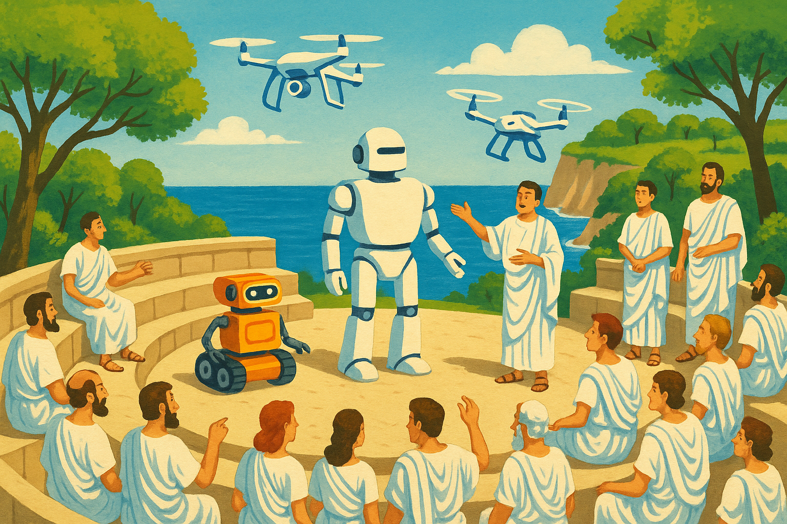

  

# 🦾 RRC Robotics Summer School 2025

Fast-paced lectures to familiarize new entrants to the lab with key areas in robotics — _perception_, _navigation_, _control_, and _learning_.

The summer school is primarily for **Honors** and **Dual Degree** students, but is open to **all students and researchers** interested in robotics — especially those on campus.

Sessions will be conducted by **graduate students and faculty** from the **RRC Lab**.

## Table Of Contents
* [Mode of Conduction](#🕒-mode-of-conduction)
* [Sessions Schedule](#📅-sessions-schedule)
* [Contact the Organizers](#📬-contact-the-organizers)

## 🕒 Mode of Conduction
- **Lectures: 11:00 AM – 1:00 PM** each day (Sundays Off) + **Hands-on Sessions: 2:00 PM onwards**
- **Location: H-101/102** 
- **Mode**: Primarily **In-Person** (Hybrid mode for remote participants)

## 📅 Sessions Schedule

| #  | Date         | Topic                             | Presenter(s)                       | Lecture Notes | Assignments |
|----|--------------|-----------------------------------|------------------------------------|---------------|-------------|
| 1  | May 17, 2025 | Introduction                      | Prof. Madhav                       | ✅            | ✅          |
| 2  | May 19, 2025 | Linear Algebra & Probability      | Vishal                             |             |           |
| 3  | May 20, 2025 | Coordinate Systems & Transformations | Aadith                          |               |             |
| 4  | May 21, 2025 | Non-Linear Optimisation           | Faizal                             |               |             |
| 5  | May 22, 2025 | Dynamics and Control - I          | Sarthak, Astik, Samaksh            |               |             |
| 6  | May 23, 2025 | Dynamics and Control - II         | Sarthak, Astik, Samaksh            |               |             |
| 7  | May 24, 2025 | Dynamics and Control - III        | Sarthak, Astik, Samaksh            |               |             |
| 8  | May 26, 2025 | Deep Learning - I                 | Yash                               |               |             |
| 9  | May 27, 2025 | Deep Learning - II                | Gaurav                             |               |             |
| 10 | May 28, 2025 | Deep Learning - III               | Swayam, Vansh                      |               |             |
| 11 | May 29, 2025 | Multi-View Geometry - I           | Rohit                              |               |             |
| 12 | May 30, 2025 | Multi-View Geometry - II          | Akash, Aneesh                      |               |             |
| 13 | May 31, 2025 | Deep Learning - IV                | Sanket                             |               |             |
| 14 | Jun 2, 2025  | Multi-View Geometry - III         | Rohit                              |               |             |
| 15 | Jun 3, 2025  | Multi-View Geometry - IV          | Rohan, Rohit                       |               |             |
| 16 | Jun 4, 2025  | Learning for 3D Vision            | Akash                              |               |             |
| 17 | Jun 5, 2025  | SLAM - I                          | Aneesh                             |               |             |
| 18 | Jun 6, 2025  | SLAM - II                         | Ansh Shah                          |               |             |
| 19 | Jun 7, 2025  | Motion Planning - I               | Faizal                             |               |             |
| 20 | Jun 9, 2025  | Motion Planning - II              | Ansh, Nabanita                     |               |             |
| 21 | Jun 10, 2025 | Motion Planning - III             | Meet, Nabanita                     |               |             |
| 22 | Jun 11, 2025 | ROS - I                           | Tarun, Soham                       |               |             |
| 23 | Jun 12, 2025 | ROS - II                          | Tarun, Soham                       |               |             |
| 24 | Jun 13, 2025 | Reinforcement Learning            | Vishal, Tejas Stanley              |               |             |
| 25 | Jun 14, 2025 | Diffusion Models in Robotics      | Jayaram                            |               |             |

📌 Note:
The schedule will be updated regularly with slides, reference material, and coding assignments as sessions are completed (by end of day). Stay tuned!

## 📬 Contact the Organizers
- **Rohit Jayanti** — [rohit.j@research.iiit.ac.in](mailto:rohit.j@research.iiit.ac.in)
